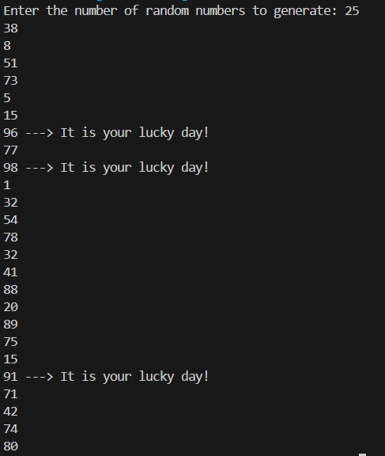
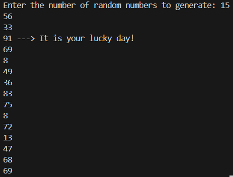

Created a code to generate random numbers and stored it in a list

What did you learn while making this app?
- I revised through the basic modules I learnt in high school

What feature did you enjoy building the most?
- using random module

What would you add next if you had more time?
- nothing

O/P:

