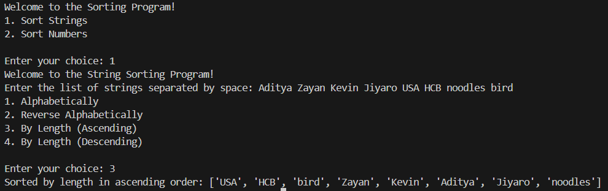
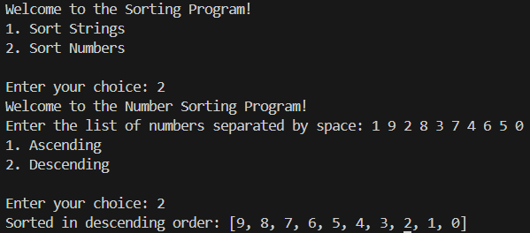

This program sorts strings and numbers based on user choice.
It provides options to sort :
    1. strings :
        a. alphabetically
        b. reverse alphabetically
        c. by length :
            i. ascending
            ii. descending order,
    2. numbers:
        a. ascending
        b. descending order.

What did you learn while making this app?
- I revised through the basics I learnt in high school

What feature did you enjoy building the most?
- Trying out many ways to sort

What would you add next if you had more time?
- maybe a complex pattern to sort the items. Maybe even combine both numbers and words.

O/P:

